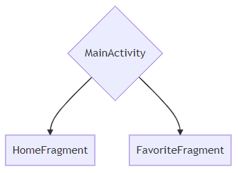
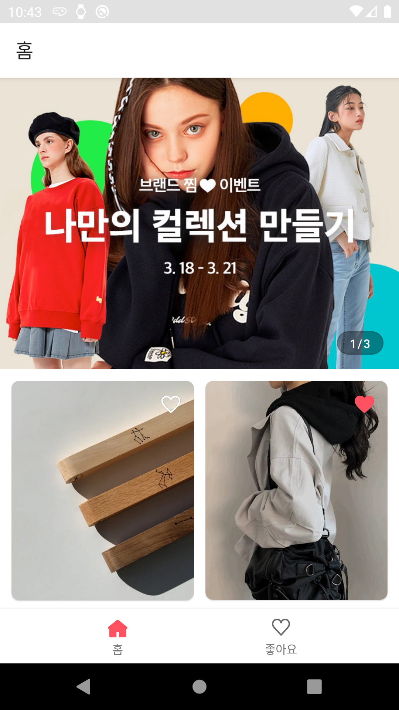
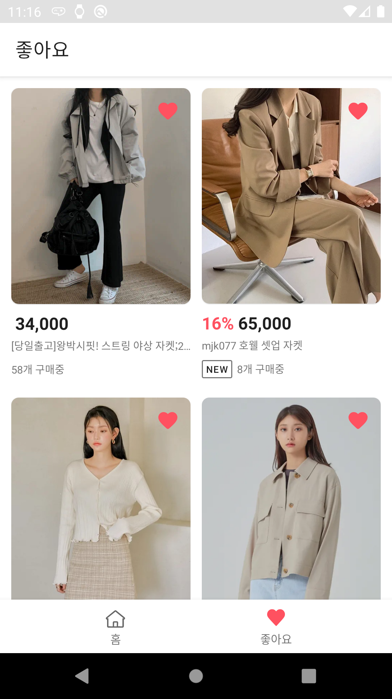

# 에이블리 안드로이드 부문 채용 과제
### 안녕하세요 이영곤입니다 안드로이드 채용 과제 제출 합니다

## 요구사항
- [x] 배너와 상품카드 모두 Vertical Scrollable 영역입니다.
- [x] 스크롤을 아래로 내려서 더 보여줄 아이템이 없을 경우에 아이템을 추가로 호출해서 붙입니다.
- [x] PullToRefresh 기능이 있습니다
- [x] API
  - [x] 최초요청 API
  - [x] 두번쨰 요청 API
- [x] 좋아요 화면
  - [x] API 사용 X
  - [x] 홈화면에서 좋아요 가 되어있는 상품들이 쌓여서 보여집니다(좋아요가 취소된 상품은 보여지지 않고 현재 좋아요가 되어있는 상품들만 노출)
  - [x] 기본적으로 페이지 첫 접근시 or 리프레시 시에 좋아요 상품 업데이트.
  - [x] (우대) 홈화면에서 찜을 해제하면 여기서도 사라져야 합니다
  - [x] (우대) 실시간으로 찜 상태가 공유되면 더욱 좋습니다
> '좋아요'는 로컬 데이터 이기 때문에 실제 서버에서 '좋아요'한 상품이 삭제 되더라도 앱에 남아 있게 됩니다

## 평가항목

- [x] 필수 기술 사항

  - [x] MVVM 패턴 사용
  - [x] Retrofit 라이브러리 사용
  - [x] Dependency Injection 사용
  - [x] Databinding + LiveData(or Observable) 사용
  - [x] Kotlin 위주의 코드

- 우대 기술 사항

  - [ ] Rx 사용
  - [ ] DI를 Dagger 라이브러리 사용
  - [ ] Clean Architecture(Repository + DataSource)
  - [ ] 간단한 UnitTest 추가
  - [ ] Kotlin 표준 라이브러리 및 collection 등의 함수와 람다를 이용한 함수형 프로그래밍

## 프로젝트 구조
 - MVVM + DataBinding + Hilt + Navigation
 - 페키지 구조
   - [di](./app/src/main/java/com/gondev/ably/subject/di): DI를 위한 모듈
   - [model](./app/src/main/java/com/gondev/ably/subject/model): 네트워크 및 데이터 베이스에서 사용하는 데이터 컨테이너 및 DTO 
   - [repository](./app/src/main/java/com/gondev/ably/subject/repository): viewmodel에서 사용하는 reopsitory
     > viewmodel은 관련 ui 페키지에 들어 있습니다
   - [ui](./app/src/main/java/com/gondev/ably/subject/ui): activity 및 fragment등 ui 관련 클레스
 - UI 구조   
 
 - 데이터 구조
   - [ProductRespone](./app/src/main/java/com/gondev/ably/subject/model/network/response/ProductList.kt#L8): 네트워크로 부터 가저온 상품 정보
   - [ProductEntity](./app/src/main/java/com/gondev/ably/subject/model/database/entify/ProductEntity.kt#L8): 상품 테이블 엔티티
   - [ProductType](./app/src/main/java/com/gondev/ably/subject/model/dto/ListType.kt#L7): 상품 정보를 베너와 함께 홈화면에 보여주기위한 POJO

   - [BannerRespone](./app/src/main/java/com/gondev/ably/subject/model/network/response/ProductList.kt#L15): 네트워크로 부터 가저온 베너 정보
   - [BannerEntity](./app/src/main/java/com/gondev/ably/subject/model/database/entify/BannerEntity.kt#L7): 베너 테이블 엔티티
   - [BannerType](./app/src/main/java/com/gondev/ably/subject/model/dto/ListType.kt#L18): 베너 뷰페이저를 홈 화면에서 보여주기위해 삽입하는 일종의 해더, [BannerEntity](./app/src/main/java/com/gondev/ably/subject/model/database/entify/BannerEntity.kt#L7)로 하위 베너 이미지 아이템을 표시한다

## 자체 평가
- RX 대신 coroutines 사용, Dagger2 대신 [Hilt](https://developer.android.com/training/dependency-injection/hilt-android?hl=ko) 사용하였습니다
- 학습 시기를 놓처 Rx와 Dagger2를 배우지 못하였습니다
- **좋아요** 표시를 하기 위해 [Room Persistence Database](https://developer.android.com/training/data-storage/room?hl=ko)를 사용 하였습니다
- 요구사항에 페이징 기술이 들어 있어 [page 2](https://developer.android.com/topic/libraries/architecture/paging?hl=ko) 와 [page 3](https://developer.android.com/topic/libraries/architecture/paging/v3-overview?hl=ko) 중에 고민 하였으나 어차피 Rx를 사용하지 않기로 한 이상 두개 사이의 고민은 의미 없다고 판단, 사용하기 간편하고 최신 기술인 paging3을 사용 하기로 결졍 하였습니다
- paging3 사용법 학습: 개인적으로 paging3 라이브러리에서 제공하는 PagingDataAdapter 가 굉장히 좋다고 생각하였습니다
- Room 라이브러리에서 POJO를 이용한 CRUD 학습
- 결과적으로 우대 기술에서 요구 한 사항중 하나도 만족 하지 못했네요 
 
## 스크린 샷
| | |

